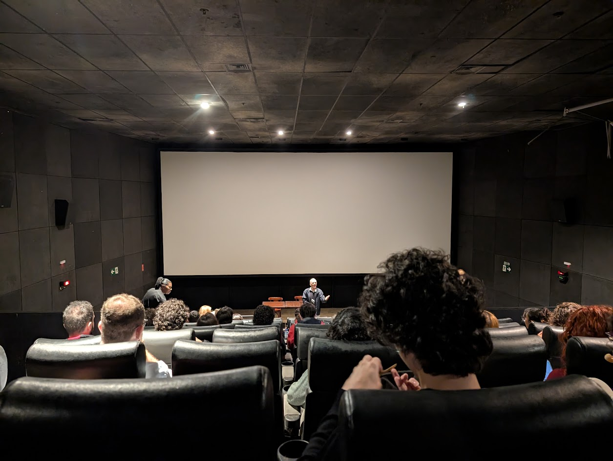
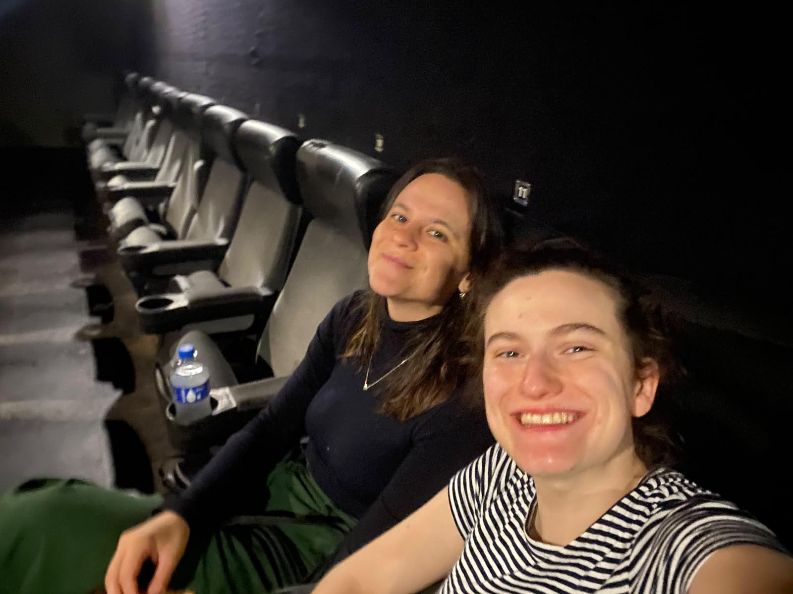

### Designer Date: Psychoanalysis, *In the Realm of the Senses*, and a Mid-Movie Escape

**Date:** June 18, 2026
**Location:** Rio de Janeiro ("Psicanálise e Cinema" event at Grupo Estação)
**Company:** Shared (with my cousin)
**Event Link:** [https://grupoestacao.com.br/experimente/psicanalise-e-cinema/](https://grupoestacao.com.br/experimente/psicanalise-e-cinema/)

Note this picture was taken before the movie (hence the smiles of ignorance)!

#### The Outing
To fulfill this week's intention, I stepped out of my usual routine. I'm not a big film buff, but my cousin is a filmmaker. Since we were hanging out in Rio, we decided to check out an event called "Psychoanalysis and Cinema". It was organized by two PUC-Rio professors (a prestigious university in Rio). The professors were Pedro Henrique Ferreira (Cinema) and Fernando Tenório (Psychology). The premise was to use film as a lens to explore human relationships and Freudian theory (as far as I understand).

To be completely upfront, it was a shock. We went in blind, not knowing what film would be shown. Well, that is a bit extreme. We knew the name and my cousin had said there may be some explicit scenes. However, what I was met with makes that the biggest understatement of the century. It turned out to be Nagisa Oshima’s In the Realm of the Senses (1976). The movie depicts an obsessive love and sex affair with highly explicit, unglamorous scenes that focus on the deeply unhealthy nature of the relationship. It was incredibly heavy, dense, and frankly, I couldn't stomach it. I bailed halfway through. We stuck around the venue, though, and caught part of the professors' discussion after the screening ended.

#### The Question & The Interaction
I am unsure what I expected to gain from this that would directly influence my thesis but I thought knowledge outside of my main discipline could not hurt (especially at a time I want to learn more about philosophy and psychology). That goal was met though because that uncomfortable viewing experience led to my question for this week, which I pitched to my cousin. You see, she had taken this class while at university and knew quite a bit about the psychology the students were learning about.

#### The Question
"Why would the professors choose a movie this heavy, and what is the actual, objective learning supposed to be from something like this? Could he not have chosen another movie?"

#### The Interaction
We had a very interesting conversation where I learned a lot about some deeper Freudian cuts I was unfamiliar with, and learned to somehow appreciate the cinematography. My cousin used her filmmaking background to deconstruct the professors' choice. As we broke down the post-movie debate, we got into Freud’s classic relational triangle (the Oedipus complex: father, mother, and child). In psychoanalysis, the father isn't strictly the literal dad. Instead, it represents the law in some way, or the boundary that separates the child from the mother and introduces societal rules.

How we process this law defines our psychological structure through different defense mechanisms (I did some more research to be able to put this more clearly. Our discussion was nowhere near this structured):

* Neurosis: You accept the law, but your desires conflict with it. The mechanism here is repression (hiding the desire in the unconscious). This is where most of society operates.
* Psychosis: You reject the Law entirely. The mechanism is foreclosure (a break from shared reality, leading to delusion).
* Perversion: You acknowledge the Law, but actively transgress it. The mechanism is disavowal (knowing the boundary exists, but making up your own rules anyway).

The Realm of the Senses serves as a brutal case study for the latter. The protagonists suffer an escalation into perversion and the death drive (Thanatos). They completely destroy the triangle by locking society, morality, and the law out of their room. When you remove that regulating third party, the dual relationship consumes them. The only remaining boundary is the physical body, which logically explains why their pursuit of pleasure ultimately terminates in destruction and death.

#### Reflection
This outing hit the core objective of getting me out of my safe environment and made me confront something radically unexpected (walking blindly into an Oshima film will do that). Even though the movie itself was objectively unpalatable to me (I unironically left the cinema), the theoretical framework behind the discussion was fascinating. Analyzing how boundaries and laws engineer human behavior, and what happens when those systems are removed, is a highly useful mental model. It was also amazing in retrospect how a movie can have such a strong emotional effect and manage to evoke a reaction like the one I had. 

The craziest part was that one of the psychology students is a priest. For context, in Brazil, there are a few mature students doing their Bachelor's degree. He left as well.

I hoped to post this somewhere to recount my experience but it was a bit too crazy. Hopefully my next designer date is more safe for work!