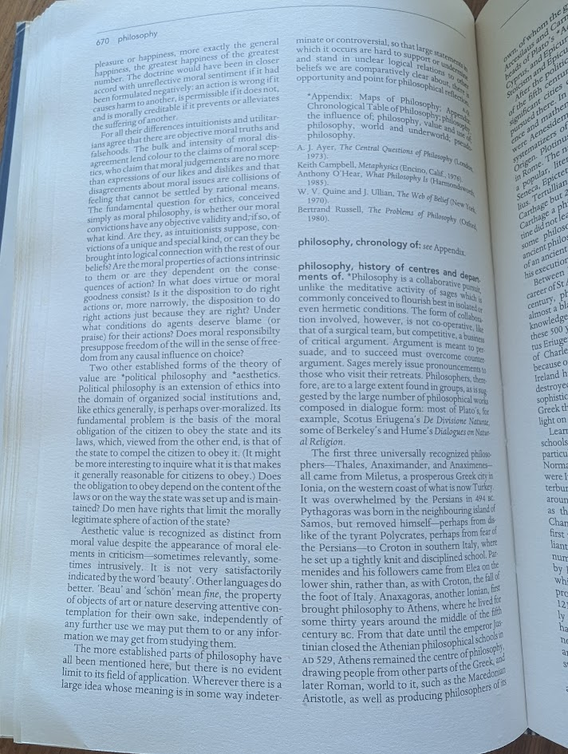

The Encyclopedia of Philosophy and the PR Problem of Modern Thought

The Outing
To fulfill this week's intention, I decided to tackle some heavy reading and flipped through the Encyclopedia of Philosophy. I usually gravitate toward fiction so navigating the highly theoretical, dense history of traditional philosophy was a bit of a departure from my usual routine. As I was reading, I noticed that almost everything that I defined as "philosophy" is incredibly old. It felt more like a historical catalog of ancient thought rather than an active, living discipline (to be fair, the textbook was old).

The Question & The Interaction
This observation sparked a bit of curiosity. I know philosophy extends far beyond ancient Greece, especially when it comes to the ethical frameworks and logic systems behind modern structures. I wanted to understand the disconnect between what philosophy actually is today versus how it is perceived. I decided to pitch my questions to two people: my dad, for a more general, pragmatic perspective, and a friend who is currently studying philosophy, for an academic view.

The Question
"Why does mainstream culture treat philosophy like an ancient artifact? If contemporary philosophy is so crucial for navigating modern systems, why is recent work so rarely spoken about compared to the classics?"

The Interaction
The resulting conversations were incredibly insightful. My dad offered a highly practical take: the classics—like Socrates, Plato, or Descartes—are essentially the greatest hits. They tackle universal, foundational human dilemmas that have survived centuries of scrutiny, making them universally relatable and much easier to teach. It is also true that they are the foundation to modern thought. Without the prior, there is no after.

My friend explained that modern philosophy isn't missing. Apparently, it just suffers from a severe specialization problem. While ancient philosophers were polymaths trying to define the entire universe, contemporary philosophers are hyper-focused on niche, highly complex domains.

We broke down the shift into a few key structural changes:

The Foundation: Ancient philosophy established the broad vocabulary and the basic "rules of the game" (metaphysics, ethics, epistemology). It was broad by necessity.

The Specialization: Modern philosophy has fractured into highly technical subsets. It hasn't disappeared; it has simply integrated itself into other disciplines. A lot of contemporary philosophy is disguised as cognitive science, AI ethics, or systems architecture.

The Accessibility Gap: Because contemporary thought deals with complex, modern structures, it lacks the romantic, accessible narratives of ancient allegories. It's much harder to casually debate the philosophical implications of algorithmic bias than it is to discuss the Allegory of the Cave.

Reflection
This exercise hit the core objective of challenging my assumptions and pulling me out of my safe environment. I went in thinking modern philosophy just had terrible PR, but I came out realizing it is simply hidden in plain sight. Contemporary philosophy is embedded in the foundational logic behind the tools, products, and societal laws we interact with every day.

Analyzing how these underlying philosophical frameworks silently engineer modern behavior—and why we are so unaware of them—is a highly useful mental model. It also made me appreciate that while those older, dense texts can feel disconnected, they are the necessary scaffolding that allows us to build and understand the highly specialized reality we live in now.