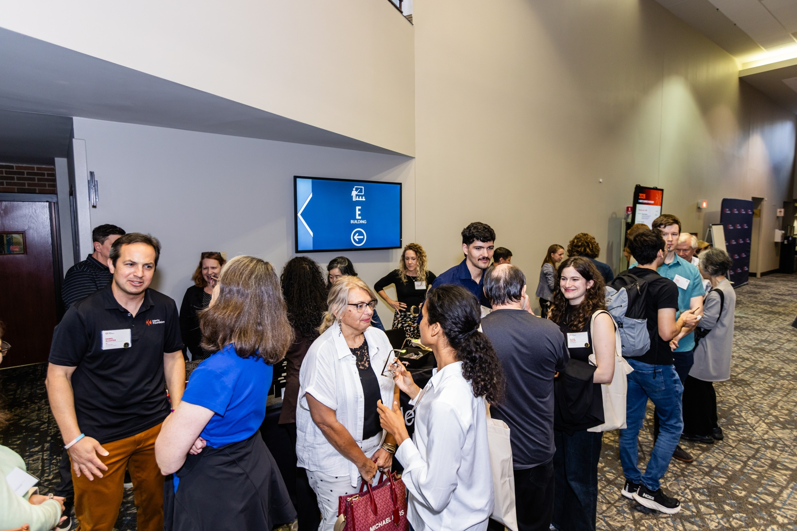

### Designer Date: Conference Corridors, Agentic Execution, and the AI Knowledge Gap

**Date:** July 14, 2026
**Location:** Conference in Chicago
**Company:** Solo (but mingling with attendees)

#### The Outing

For this week's date, I used my time at a recent conference in Chicago. The prompt this week asked to explore Technology, so I decided to use the academic environment to try and map out how people are actually interacting with AI in their professional lives. I didn't target a specific person; instead, I chatted with a broad, random mix of attendees—from PhD students, to recent graduates, to industry professionals.

#### The Questions & The Interaction

The goal was to get a global view of how this technology is actively shaping workflows.

#### The Questions

I approached different groups during coffee breaks and networking sessions with three core questions:

1. "How are you practically implementing AI into your day-to-day workflow and research right now?"
2. "What do you consider to be the most pressing, unresolved issue with the current state of this technology?"
3. "As we move toward more autonomous AI systems, what is the biggest debate you are having regarding agent execution?"

#### The Interaction

The responses were incredibly varied and highlighted how deeply embedded this technology already is in everyone's day-to-day life.

When discussing workflows, the PhD students brought up a fascinating, albeit concerning, trend in academia: the effect AI is having on published papers. They noted that it is heavily used for drafting, but also that peer reviewers are increasingly relying on it to summarize or evaluate submissions.

The answers to the second and third questions sparked some intense debates. There was a massive disconnect in how much different people actually knew about the underlying technology. Some attendees viewed it purely as a productivity tool, while others were deeply anxious about reliability and privacy. Some brought up heavy concerns regarding national security, specifically around data sovereignty and what happens when proprietary or sensitive information is fed into external models.

When it came to agent execution, the debate centered heavily on reliability. People are eager for changing workflows that eliminate busywork, but the lack of trust in an agent's ability to execute a multi-step task without hallucinating or making a critical error remains a massive bottleneck.

#### Reflection

Being in a space with so many different perspectives highlighted that the biggest hurdle in technology right now isn't necessarily capability, but alignment and literacy. The disconnect between the people building these tools and the people using them (or fearing them) is vast. It highlighted  that when you introduce a technology that alters workflows, you have to design for varying levels of trust, different use cases, and the very real ethical implications of privacy/security.

It was interestig to just wander, ask questions, and listen to the industry argue with itself in real time!

