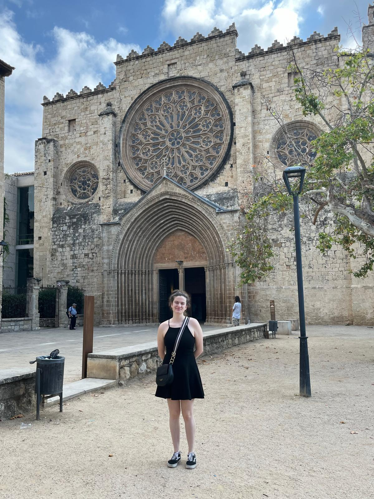

### Week 7 HW: Designer Date Submission

* **Date:** July 26, 2026
* **Location:** Monestir de Sant Cugat, Catalonia.
* **Solo vs. Shared:** The physical outing was solo the conversational reflection was shared at home.

#### The Outing
For this week's date, I wanted to step away from the digital realm so I asked Gemini what I could do. It suggested going to a monastery in Sant Cugat, and look at how privacy and community were designed historically. I though this was an interesting idea and so visited the Monestir de Sant Cugat. It’s a relatively small but beautiful Romanesque monastery. I tried to view it through the lens of my (maybe) thesis... a physical manifestation of a private, vetted community. The cloister kind of acts as a middleware. It’s an architectural boundary that isolates the community from the noise and chaos of the outside world, creating a secure space for prayer, study, gatherin, etc. to happen without external surveillance.

#### The Questions & The Interaction
Because the monastery itself was quiet, I decided to take my reflections home and discuss them with Silvia, who is a history enthusiast rather than a technologist, and my grandma who is into interior design. I needed to see if my opportunity space (designing data-sovereign middleware for highly vetted fellowship community) made sense when stripped of its technical jargon.

I asked them: 
* When you look at the architecture of historical spaces like the Monestir, how much of the design do you think was about keeping people out, versus keeping the community inside connected?

**The Interaction:**
The conversation was incredibly grounding. By using the Monestir’s architecture as a metaphor, we didn't have to get bogged down in software mechanics. She pointed out that the thick walls of a monastery weren't just for defense, they were designed to curate the environment, controlling the light, the sound, and the flow of information. My grandma also pointed out how you still had different spaces too, and how the choice of what to have or not hvae in those spaces influenced how people interacted with them.  It made me realize that in my thesis, my goal iss to design the interior of that space so that the community feels comfortable enough to truly collaborate. Translating my technical gear into a historical, physical constraint helped validate that the human need for bespoke, isolated community spaces hasn't changed.. only the medium has.